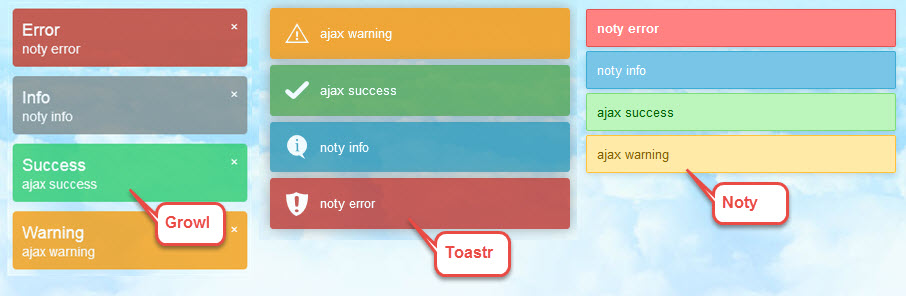

# Yii2-notification-wrapper
[](https://packagist.org/packages/loveorigami/yii2-notification-wrapper) 
[](https://packagist.org/packages/loveorigami/yii2-notification-wrapper)
[](https://packagist.org/packages/loveorigami/yii2-notification-wrapper)
[](https://packagist.org/packages/loveorigami/yii2-notification-wrapper)
[](https://packagist.org/packages/loveorigami/yii2-notification-wrapper)

Yii2-notification-wrapper module renders a message from session flash (with ajax support). All flash messages are displayed in the sequence they were assigned using setFlash.



You can set message as following:

 ```php
public function actionIndex(){
    ...
     Yii::$app->session->setFlash('error',   'noty error');
     Yii::$app->session->setFlash('info',    'noty info');
     Yii::$app->session->setFlash('success', 'noty success');
     Yii::$app->session->setFlash('warning', 'noty warning');
    ...
     return $this->render('index');
 }

 // or in ajax action

 public function actionAjax(){
     ...
     Yii::$app->session->setFlash('error',   'ajax error');
     Yii::$app->session->setFlash('info',    'ajax info');
     Yii::$app->session->setFlash('success', 'ajax success');
     Yii::$app->session->setFlash('warning', 'ajax warning');
     ...
     $data = 'Some data to be returned in response to ajax request';
     Yii::$app->response->format = \yii\web\Response::FORMAT_JSON;
     return $data;
  }
 ```

## Installation

The preferred way to install this extension is through [composer](http://getcomposer.org/download/).

To install with bower package for one of supported layers, either run

```bash
$ php composer.phar require loveorigami/yii2-notification-wrapper "*"
# if you want use it
$ php composer.phar require bower-asset/noty "^2.3"
$ php composer.phar require bower-asset/jquery-growl "^1.3" 
```

or add

```bash
"loveorigami/yii2-notification-wrapper": "*",
"bower-asset/noty": "^2.3",
"bower-asset/jquery-growl": "^1.3"
```

to the ```require``` section of your `composer.json` file.


## Configure application

Let's start with defining module in our config file (`@common/config/main.php`):

```php
'modules' => [
    'noty' => [
        'class' => 'lo\modules\noty\Module',
    ],
],
```
That's all, now you have module installed and configured.

## Usage

This package comes with a Wrapper widget that can be used to regularly poll the server for new notifications and trigger them visually using either Noty (or Toastr, or Growl etc.).

This widget should be used in your main layout file as follows:

```php
use lo\modules\noty\Wrapper;

// for Bootstrap Alert
echo Wrapper::widget();

// or for Growl
echo Wrapper::widget([
    'layerClass' => 'lo\modules\noty\layers\Growl',
]);

// or for Noty
echo Wrapper::widget([
    'layerClass' => 'lo\modules\noty\layers\Noty',
]);
```


# Advanced usage

Every layer may be customizable from parameter ```options``` in the widget.
For more information - read documentation.

```php
use lo\modules\noty\Wrapper;

echo Wrapper::widget([
    'layerClass' => 'lo\modules\noty\layers\Noty',
    'layerOptions'=>[
        // for every layer (by default)
        'layerId' => 'noty-layer',
        'customTitleDelimiter' => '|',
        'overrideSystemConfirm' => true,
        'showTitle' => true,

        // for custom layer
        'registerAnimateCss' => true,
        'registerButtonsCss' => true
    ],

    // clientOptions
    'options' => [
        'dismissQueue' => true,
        'layout' => 'topRight',
        'timeout' => 3000,
        'theme' => 'relax',

        // and more for this library...
    ],
]);

```

Some libraries can override System Confirm for links as:

```html
<a href="https://github.com" data-confirm="Are you sure?">Go!</a>
```

## Custom title

If you want change notification title, you can use ```customTitleDelimiter``` in our messages

```php
    echo  Wrapper::widget([
        'layerClass' => '...',
        'layerOptions' => [
            'customTitleDelimiter' = '|', // by default
        ],
    ]);
```

and set message in action as

```php
public function actionIndex(){
    ...
     Yii::$app->session->setFlash('success', 'CUSTOM TITLE | noty success');
    ...
 }
```

## Layer Id 

If you want paste notification message in custom div, you can use ```layerId```.
For example:


```php
// In layout:
    $layerParams = [
        'layerClass' => '...',
        'layerOptions' => [
            ...
        ],
    ];
    
    if (isset($this->params['layerParams']){
        $layerParams = \yii\helpers\ArrayHelper::merge($layerParams, $this->params['layerParams']);
    }
    echo  Wrapper::widget($layerParams);
    
    
// In view:
    $this->params['layerParams'] = [
        'layerClass' => 'lo\modules\noty\layers\Alert',
        'layerOptions' => [
            'layerId' => 'my-noty-id',
        ],
    ];
 
    echo '<div id="my-noty-id"></div>'; // and notification will be placed here
```

## Disable showNoty after ajax calls
* In Ajax script
```js 
    $.ajax({
        method: 'GET',
        dataType: 'json',
        url: someresouceurl,
        showNoty: false, // add this for disable notification
        success: function(data) {
        }
    });
```

* In Pjax
```php
    Pjax::begin([
        'clientOptions' => [
            'showNoty' => false
        ]
    ]); 
    ... pjax container ...
    Pjax::end(); 
```

## Noty Exceptions

For example:
```php
use lo\modules\noty\exceptions\NotyFlashException;
use lo\modules\noty\exceptions\NotyErrorException;

public function actionUpdate($id)
{
    $model = $this->findModel($id);

    try {
        if ($model->load(Yii::$app->request->post()) && $model->save()) {
            return $this->redirect(['view', 'id' => $model->id]);
        } else {
            return $this->render('update', [
                'model' => $model,
            ]);
        }
    } catch (NotyFlashException $e) {
        $e->catchFlash();
    }
}
    
protected function findModel($id)
{
    if (($model = Post::findOne($id)) !== null) {
        return $model;
    } else {
        throw new NotyErrorException('The requested page does not exist.');
    }
}
```

## Supported layers

Currently supported layers are:

| Library (Layer)      | Bower                       | Confirm | Project homepage                                     | Docs                              |
| -------------------- | --------------------------- | ------- | ---------------------------------------------------- | --------------------------------- |
| Bootstrap Alert      | -                           |    -    | http://getbootstrap.com/components/#alerts           | [read](docs/Alert.md)             |
| Bootstrap Notify     | remarkable-bootstrap-notify |    -    | https://github.com/mouse0270/bootstrap-notify        | [read](docs/BootstrapNotify.md)   |
| Growl                | jquery-growl                |    -    | https://github.com/ksylvest/jquery-growl             | [read](docs/Growl.md)             |
| iGrowl               | igrowl                      |    -    | https://github.com/catc/iGrowl                       | [read](docs/Igrowl.md)            |
| jQuery Notify        | jquery.notify               |    -    | https://github.com/CreativeDream/jquery.notify       | [read](docs/JqueryNotify.md)      |
| jQuery Notify Bar    | jqnotifybar                 |    -    | https://github.com/dknight/jQuery-Notify-bar         | [read](docs/JqueryNotifyBar.md)   |
| jQuery Toaster       | jquery.toaster              |    -    | https://github.com/scottoffen/jquery.toaster         | [read](docs/JqueryToaster.md)     |
| jQuery Toast Plugin  | jquery-toast-plugin         |    -    | https://github.com/kamranahmedse/jquery-toast-plugin | [read](docs/JqueryToastPlugin.md) |
| Lobibox              | lobibox                     |    +    | https://github.com/arboshiki/lobibox                 | [read](docs/Lobibox.md)           |
| Notie                | notie                       |    +    | https://github.com/jaredreich/notie                  | [read](docs/Notie.md)             |
| Notific8             | notific8                    |    -    | https://github.com/ralivue/notific8                  | [read](docs/Notific8.md)          |
| NotifIt              | notifit                     |    +    | https://github.com/naoxink/notifIt                   | [read](docs/NotifIt.md)           |
| Notify.js            | notifyjs                    |    -    | https://github.com/notifyjs/notifyjs                 | [read](docs/Notifyjs.md)          |
| Noty                 | noty                        |    +    | https://github.com/needim/noty                       | [read](docs/Noty.md)              |
| PNotify              | pnotify                     |    +    | https://github.com/sciactive/pnotify                 | [read](docs/PNotify.md)           |
| Sweetalert           | sweetalert                  |    +    | https://github.com/t4t5/sweetalert                   | [read](docs/Sweetalert.md)        |
| Toastr               | toastr                      |    -    | https://github.com/CodeSeven/toastr                  | [read](docs/Toastr.md)            |


## Full installation

Add

```bash
"loveorigami/yii2-notification-wrapper": "*",
"bower-asset/bootstrap-sweetalert": "^1.0",
"bower-asset/igrowl": "*",
"bower-asset/jqnotifybar": "^1.5",
"bower-asset/jquery-growl": "^1.3",
"bower-asset/jquery.notify": "^1.0",
"bower-asset/jquery-toast-plugin": "*",
"bower-asset/jquery.toaster": "*",
"bower-asset/lobibox": "*",
"bower-asset/notie": "^3.2",
"bower-asset/notifit": "^1.1",
"bower-asset/notific8": "^3.5",
"bower-asset/notifyjs": "^0.4",
"bower-asset/pnotify": "^3.0",
"bower-asset/noty": "^2.3",
"bower-asset/remarkable-bootstrap-notify": "^3.1",
"bower-asset/sweetalert": "^1.1",
"bower-asset/toastr": "^2.1"
```

to the ```require``` section of your `composer.json` file.

## License

Yii2-notification-wrapper is released under the MIT License. See the bundled [LICENSE.md](LICENSE.md)
for details.
