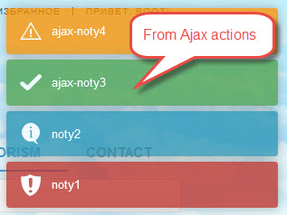

# Yii2-notification-wrapper

Yii2-notification-wrapper module renders a message from session flash (with ajax support). All flash messages are displayed
in the sequence they were assigned using setFlash. You can set message as following:



 ```php
public function actionIndex(){
    ...
     \Yii::$app->getSession()->setFlash('error',   'noty1');
     \Yii::$app->getSession()->setFlash('info',    'noty2');
     \Yii::$app->getSession()->setFlash('success', 'noty3');
     \Yii::$app->getSession()->setFlash('warning', 'noty4');
    ...
     return $this->render('index');
 }
 // or in ajax action

 public function actionAjax(){
     ...
      \Yii::$app->getSession()->setFlash('error',   'ajax-noty1');
      \Yii::$app->getSession()->setFlash('info',    'ajax-noty2');
      \Yii::$app->getSession()->setFlash('success', 'ajax-noty3');
      \Yii::$app->getSession()->setFlash('warning', 'ajax-noty4');
     ...
     $data = 'Some data to be returned in response to ajax request';
     Yii::$app->response->format = \yii\web\Response::FORMAT_JSON;
     return $data;
  }
 ```

Download
--------

Yii2-notification-wrapper can be installed using composer. Run following command to download and
install Yii2-notification-wrapper:

```bash
composer require "loveorigami/yii2-notification-wrapper": "*"
```

Configure application
---------------------

Let's start with defining module in our config file (`@common/config/main.php`):

```php
'modules' => [
    'noty' => [
        'class' => 'lo\modules\noty\Module',
    ],
],
```
That's all, now you have module installed and configured.

Usage
-----

This package comes with a NotyWidget that can be used to regularly poll the server for new notifications and trigger them visually using either Toastr, or Noty.

This widget should be used in your main layout file as follows:

```php
use lo\modules\noty\widgets\Noty;

Noty::widget([
    'theme' => Noty::THEME_TOASTR,
    'options' => [
        'closeButton' => false,
        'debug' => false,
        'newestOnTop' => true,

        // and more for this library...
    ],
]);
```

Supported libraries
-------------------

Currently supported libraries are:

| Library        | Constant      | Project homepage                               |
| -------------- | ------------- | ---------------------------------------------- |
| Noty           | THEME_NOTY    | https://github.com/Shifrin/yii2-noty           |
| Toastr         | THEME_TOASTR  | https://github.com/lavrentiev/yii2-toastr      |


License
-------

Yii2-notification-wrapper is released under the MIT License. See the bundled [LICENSE.md](LICENSE.md)
for details.