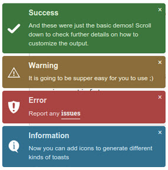

# Jquery Toast Plugin


Installation
--------

```bash
"loveorigami/yii2-notification-wrapper": "*",
"bower-asset/jquery-toast-plugin": "*"
```

to the ```require``` section of your `composer.json` file.


Usage
-----

```php
use lo\modules\noty\Wrapper;

echo Wrapper::widget([
         'layerClass' => 'lo\modules\noty\layers\JqueryToastPlugin',
         // default options
         'options' => [
            'showHideTransition' => 'slide',  // It can be plain, fade or slide
            'allowToastClose' => 'true', // Show the close button or not
            'hideAfter' => 3000, // `false` to make it sticky or time in miliseconds to hide after
            'stack' => 5, // `false` to show one stack at a time count showing the number of toasts that can be shown at once
            'position' => 'top-right', // bottom-left or bottom-right or bottom-center or top-left or top-right or top-center or mid-center or an object representing the left, right, top, bottom values to position the toast on page

        // and more for this library here https://github.com/kamranahmedse/jquery-toast-plugin
    ],
]);

```
