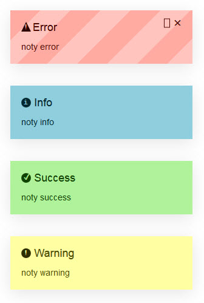

# PNotify


Installation
--------

```bash
"loveorigami/yii2-notification-wrapper": "*",
"bower-asset/pnotify": "^3.0"
```

to the ```require``` section of your `composer.json` file.


Usage
-----

```php
use lo\modules\noty\Wrapper;

echo Wrapper::widget([
         'layerClass' => 'lo\modules\noty\layers\PNotify',
         // default options
         'options' => [
             'styling' => 'brighttheme', // jqueryui, bootstrap3, brighttheme
             'min_height' => '16px',
             'delay' => 3000,
             'icon' => true,
             'remove' => false,
             'shadow' => true,
             'mouse_reset' => true,
             'buttons' =>[
                 'closer' => true,
                 'sticker' => true
             ]

              // and more for this library here https://github.com/sciactive/pnotify

         ],
     ]);


```
